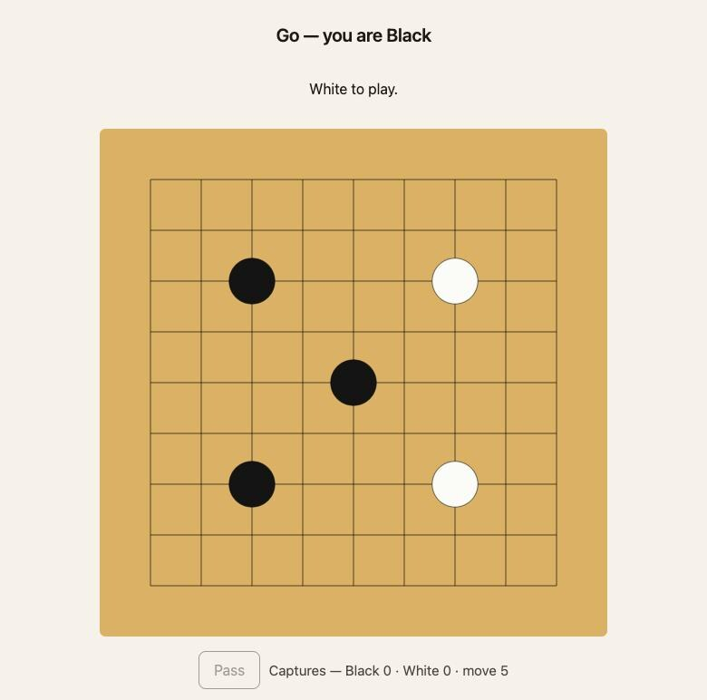

# avgo

[](https://github.com/konradhalas/avgo/actions/workflows/ci.yml)

> "I can't code in Aver, but I can write prompts with typos"
>
> — Konrad Hałas

A two-player game of Go over the web, written in [Aver](https://averlang.dev/).

Open the site, enter your name and press **Create game**, then send the link
you get to one other person. They enter their own name, press **Join game**,
and play starts. Colours are drawn at random, the board is 9×9, and every game
lives in memory only — restarting the server forgets them all.

<p align="center">
  
</p>

## Run it

```bash
docker compose up --build
```

Then open <http://localhost:8080>.

Or without compose:

```bash
docker build -t avgo .
docker run --rm -p 8080:8080 avgo
```

`PORT` overrides the listen port (default `8080`).

## Behind Traefik

`docker-compose.traefik.yml` adds Traefik in front, with HTTP→HTTPS redirection
and a Let's Encrypt certificate:

```bash
AVGO_HOST=go.example.com ACME_EMAIL=you@example.com \
  docker compose -f docker-compose.traefik.yml up -d --build
```

Point an A record at the host first — the TLS-ALPN challenge needs the name to
resolve before a certificate can be issued.

**Run exactly one replica.** Every board lives in the process's memory, so a
second instance would answer half the requests with "no such game". Sticky
sessions do not help: the two players are two different browsers and both have
to reach the same process. Growing past one machine means moving the store out
of memory first, which is the one thing this MVP deliberately does not do.

Restarts have the same consequence — `restart: unless-stopped` brings the
server back with no games in it.

## How it is put together

The whole server is Aver source interpreted by the `aver` binary; the container
carries the interpreter and the `.av` files, not a compiled artifact.

| File | Responsibility |
|---|---|
| `main.av` | Reads the two pages off disk, builds an empty store, starts the serve loop |
| `go/board.av` | Board, groups, liberties, captures, suicide, area scoring — pure |
| `go/game.av` | Seats, turn order, the simple ko rule, passing — pure |
| `web/store.av` | Every live game plus the pages, all in memory |
| `web/router.av` | The whole HTTP surface as one pure `store + request -> store + response` |
| `web/server.av` | HTTP/1.1 poll loop over `Tcp`, threading the store between requests |
| `web/static/*.html` | Lobby and game page, plain HTML with a canvas board |

Aver has no mutable state and no closures, so the game store is threaded
through the serve loop instead: each completed request produces a new store,
which the next tick of the loop carries forward. That keeps the router a
plain function, and every rule in `go/` is verified without a socket.

### API

All endpoints answer JSON. A player's secret travels in the `x-player-token`
header.

| Endpoint | Meaning |
|---|---|
| `POST /api/games` | Create a game. Body `name=<player>`. Returns `id`, `token`, `color` |
| `POST /api/games/{id}/join` | Take the open seat. Body `name=<player>`. Returns `token`, `color` |
| `GET /api/games/{id}` | Current state, including `you` for the caller |
| `POST /api/games/{id}/move` | Body `idx=<0..80>` or `pass=true` |

Refusals — not your turn, occupied point, suicide, ko, a full game — come back
as `{"error": "..."}` with a 4xx status and are shown to the player verbatim.

## Development

There is no local `aver` install; the toolchain lives in an image:

```bash
docker build --target dev -t avgo-toolchain .

# type-check every module
docker run --rm -v "$PWD":/app -w /app avgo-toolchain \
  check main.av --module-root .

# run the verify blocks
docker run --rm -v "$PWD":/app -w /app avgo-toolchain \
  verify . --module-root .
```

`aver check` treats a function without a `verify` block as an error, so every
function here has one: 180 cases across 5 modules, covering captures, suicide,
ko, scoring and each HTTP route.

CI (`.github/workflows/ci.yml`) runs both of those on every push and pull
request, builds the runtime image, and then plays a game against the container
it just built — create, join, a move, a move out of turn, an unknown game.
Both `aver` commands exit non-zero on failure, so a broken rule fails the
build rather than being reported and ignored.

## Known limits

These are deliberate for an MVP:

- One board size (9×9), no handicap, no komi.
- Simple ko only — the position immediately before the last move. Longer
  superko cycles are not detected.
- Two passes end the game and area scoring decides it; there is no dead-stone
  agreement phase, so a game has to be played out.
- Games are never evicted. A long-running server accumulates them.
- The client polls once a second; there are no websockets.
- `HttpRequest.query` is unreadable in the Aver 0.29.0 VM (it type-checks, then
  fails at runtime), which is why the player token is a header rather than a
  query parameter.
